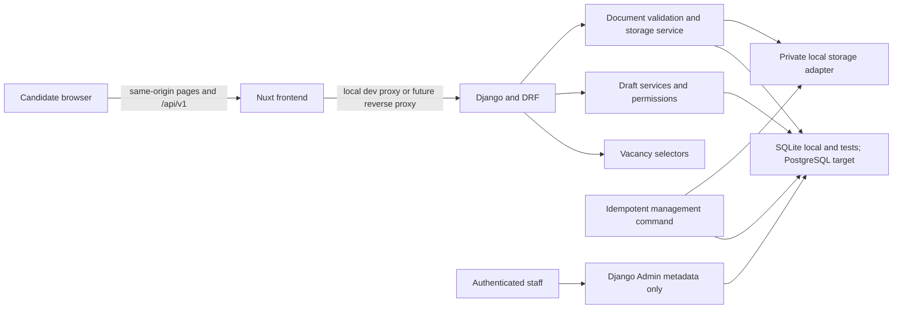
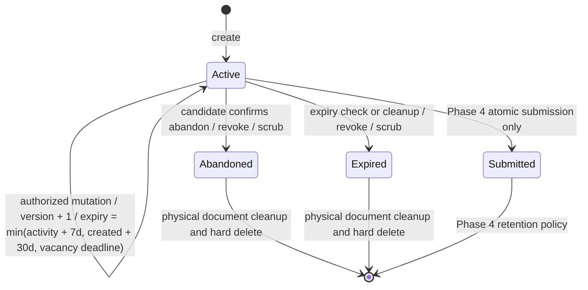

# Backend Architecture

## Current-State Findings

- Django 5.2.15 and Django REST Framework 3.17.1 provide a modular-monolith foundation with focused
  `vacancies`, `applications`, and `documents` apps.
- Phase 2 exposes health and read-only published-vacancy APIs. Unmarked DRF views are staff-only by
  default, and candidate mutation permissions do not exist yet.
- `ApplicationDraft` already has a UUID, vacancy owner, password-style credential hash, structured
  candidate and experience-summary fields, lifecycle status, expiry, and timestamps.
- `ApplicationDocument` already enforces exactly one draft or application owner and at most one
  active document per owner. It stores metadata only; no file is accepted or saved.
- The error handler creates the documented envelope but currently creates request IDs only for
  errors and does not share them with request logs or headers.
- CSRF middleware is enabled, but there is no anonymous CSRF-token bootstrap endpoint yet and the
  final Phase 3 cookie contract remains unimplemented.
- The Nuxt frontend keeps one draft in `useState`, uses typed fixture services, checks vacancy
  ownership in `useApplicationDraft`, reads only browser file metadata, and preserves accessible
  loading and recovery states. Refreshing or closing the tab loses the draft.
- The existing product uses experience level, skills, a short message, and a CV. Phase 3 explicitly
  adds zero to five bounded CRUD employment entries ordered by `position`; they remain optional so
  the CV and existing free-text summary stay primary.
- No package currently performs PDF structural parsing. A parser dependency would require separate
  approval before implementation.

## References

Repository decisions remain authoritative:

- [ADR 0002](decisions/0002-backend-django-postgresql.md): Django REST Framework and PostgreSQL.
- [ADR 0004](decisions/0004-draft-persistence.md): anonymous server-side drafts.
- [ADR 0005](decisions/0005-candidate-authentication.md): no candidate accounts.
- [ADR 0007](decisions/0007-cv-storage.md): private CV storage with generated names.
- [ADR 0008](decisions/0008-state-management.md): composables and typed services without Pinia.
- [ADR 0009](decisions/0009-same-origin-deployment.md): same-origin first deployment.

An official Django 5.2 and Nuxt documentation refresh was attempted for this plan, but the web
search and direct-page tools both returned HTTP 403 before content was available. Recheck the
official CSRF, cookie, upload, storage, and development-proxy guidance before implementation. No
claim in this plan depends on unverified framework behavior beyond the pinned repository baseline.

## Recommended System

Keep ApplyFlow as a modular monolith. Phase 3 does not justify microservices, a queue, Redis,
Celery, an API gateway, or a state library.



### Responsibilities

| Component | Phase 3 responsibility |
| --- | --- |
| Models | Persistence, lifecycle timestamps, version, bounded child records, indexes, and constraints. |
| Serializers | Partial-draft validation, API field naming, safe response projection, and multipart metadata validation. |
| Draft ownership service | Parse the compound cookie, load only its UUID target, verify the secret hash, and reject non-active or expired drafts. |
| Draft services | Create, mutate, abandon, scrub, refresh effective expiry, increment version, and enforce vacancy ownership. |
| Experience services | Create, update, order, cap, and delete entries only under an authorized draft. |
| Document validator | Enforce extension, MIME, byte limit, signature, structural PDF checks, active-content rejection, filename normalization, and checksum calculation. |
| Storage interface | Save, open for internal validation/future streaming, delete, test existence, and enumerate stale private objects without leaking provider details into models. |
| Document services | Coordinate validation, storage, metadata, replacement, logical deletion, compensation, and cleanup. |
| Request middleware | Generate one request ID, return it in `X-Request-ID`, and expose privacy-safe context to errors and logs. |
| Cleanup command | Expire and scrub drafts, delete physical blobs, retry pending deletion, and remove stale orphan objects. |
| Nuxt typed service | Acquire CSRF, call same-origin APIs, normalize errors, and report upload progress. |
| Nuxt composable | Hold the authoritative aggregate in memory, coordinate bootstrap, debounced save, conflicts, and route transitions. |

## Anonymous Ownership Decision

Phase 3 keeps the accepted **one active draft total per browser** rule.

This matches the existing frontend conflict flow and ADR 0004, minimizes credential count and
tracking surface, and gives candidates a clear continue-or-abandon choice. One cookie per vacancy
would require a credential collection or multiple cookies, more cleanup and selection logic, and a
larger privacy surface without supporting the first-version product goal.

This is a same-browser product rule, not a globally enforceable identity constraint. If a candidate
deletes or loses the cookie, the server cannot identify that browser without adding fingerprinting
or an account, so it may create a new draft while the inaccessible old draft waits for expiry. The
design accepts that residual duplication in order to preserve privacy and cleanup simplicity.

### Credential Format And Storage

- Generate 32 random bytes with a cryptographically secure server API and encode them as unpadded
  base64url, providing 256 bits of entropy.
- Set the cookie value to a versioned compound credential:
  `v1.<draft_uuid>.<raw_random_secret>`. The UUID is a locator, not proof of ownership.
- Store only the existing Django password hash of the random secret in `secret_hash`; never store or
  return the compound cookie value.
- Load the UUID named by the cookie and then run a constant-behaviour secret check. Never scan
  hashes or accept a route UUID without verifying that it equals the cookie UUID.
- Do not rotate on ordinary reads or autosaves because concurrent tabs could invalidate each other.
  Revoke on abandonment, expiry, and future submission. Add a new explicit rotation action only if
  a later recovery flow creates a real need.
- Invalid, missing, revoked, expired, cross-draft, cross-document, and cross-experience attempts all
  return `404 draft_unavailable`. The server may clear an unusable cookie but does not reveal which
  check failed.
- An invalid cookie on draft creation is never adopted and never creates a replacement in the same
  request. The frontend can start a clean second request after the cookie is cleared.
- Do not use localStorage, sessionStorage, browser fingerprints, device identifiers, or URL
  credentials for draft ownership. Cross-device recovery remains out of scope.

### Cookie Settings

| Attribute | Production | Local development |
| --- | --- | --- |
| Name | `applyflow_draft` | Same |
| Value | Versioned draft UUID plus raw random secret | Same |
| `HttpOnly` | `True` | `True` |
| `Secure` | `True` | `False` only when `APP_ENV=development` and HTTPS is unavailable |
| `SameSite` | `Lax` | `Lax` |
| `Path` | `/api/v1/application-drafts/` | Same |
| `Domain` | Unset, creating a host-only cookie | Unset |
| Lifetime | Effective expiry is the earliest of seven days after the last successful mutation, thirty days after creation, and the vacancy deadline | Same |

The cookie path deliberately excludes Django Admin and unrelated public routes. Cookie deletion
must repeat the same name, path, and host scope. `Secure=False` is permitted only for the explicit
local development environment when HTTPS is unavailable. Renew the cookie only after successful
mutations. Clear it after abandonment, expiry, revocation, or invalid ownership.

## CSRF And Same-Origin Design

- Keep `CsrfViewMiddleware`; do not exempt draft or upload views.
- Add `GET /api/v1/csrf/`, call Django's token-generation API, return the masked token in a
  no-store JSON response, let Django set or refresh the CSRF cookie, and preserve `Vary: Cookie`.
- Keep the masked token only in Nuxt memory. Send it as `X-CSRFToken` on every unsafe request with
  same-origin credentials. If a mutation fails with a CSRF rejection, reacquire a fresh token
  before retrying when the interaction is still safe to repeat.
- Use a Nuxt local development proxy for `/api/**` so the browser still sees one origin while Nuxt
  and Django use separate ports. Use one hostname consistently (`127.0.0.1` or `localhost`), not a
  mixture.
- Do not add `django-cors-headers`; Phase 3 APIs remain same-origin only. Reject unexpected `Origin`
  values and do not use wildcard trusted origins.
- `CSRF_TRUSTED_ORIGINS` is an explicit environment list only for a reviewed reverse-proxy origin
  mismatch. It is not needed for an ordinary same-origin browser request.
- Server-generated credentials prevent fixation. `SameSite=Lax` and CSRF checks reduce cross-site
  mutation, while `HttpOnly` prevents JavaScript from reading the draft credential.
- XSS can still issue same-origin requests as the candidate even though it cannot read the cookie.
  Preserve Vue escaping, avoid unsafe HTML, keep vacancy content structured, and add a reviewed CSP
  during deployment hardening.

## Draft Lifecycle

Draft expiry combines three bounds:

- seven days after the last successful state mutation;
- thirty days after draft creation;
- the vacancy application deadline.

`last_activity_at` advances only after a successful state mutation: candidate save, experience
summary save, experience-entry create/update/delete, CV create/replace/delete, or abandonment.
Reads do not extend retention. `expires_at` stores the effective earliest boundary and never
extends beyond `created_at + 30 days` or the vacancy deadline.



Rules:

- Creation requires a published, unexpired vacancy and creates one empty active draft.
- `GET /api/v1/application-drafts/active/` returns `204` when no ownership cookie exists, `200`
  plus the aggregate when a valid active draft exists, and generic `404 draft_unavailable` while
  clearing malformed, invalid, expired, or revoked ownership cookies.
- `POST /api/v1/application-drafts/` creates a draft with `201` when no active draft exists, is
  idempotent with `200` for the same vacancy, and returns `409 active_draft_conflict` for another
  vacancy. It never silently replaces or reassigns a draft.
- Each mutation locks the draft row briefly, verifies ownership, status, expiry, vacancy, and
  `If-Match`, applies validated changes, increments `version`, and refreshes activity/expiry.
- Every authorized draft response returns `ETag: "draft-<version>"`. Missing `If-Match` returns
  `428 draft_version_required`; a stale version returns `409 draft_conflict`; the server never
  performs a last-write-wins merge.
- Starting another vacancy returns `409 active_draft_conflict`. Continue returns to the existing
  vacancy. Abandon requires a separate confirmation and authorized `DELETE`.
- Abandonment uses `DELETE /api/v1/application-drafts/{draft_id}/`, requires `If-Match`, returns
  `204`, revokes the secret, and clears the cookie.
- Abandonment and expiry set `credential_revoked_at`, scrub structured candidate fields, delete
  experience entries, logically delete the document, and clear the cookie. The draft shell remains
  only while physical storage deletion needs a durable key, then cleanup hard-deletes it.
- A direct request after expiry follows the same revoke-and-scrub path before returning the generic
  unavailable response.
- Cleanup is an idempotent Django management command. It supports dry-run reporting, bounded
  batches, retries pending physical deletions, and privacy-safe aggregate counts. Scheduling is a
  deployment decision, not Phase 3 infrastructure.
- Phase 4 owns atomic submission. It will copy candidate and experience data, transfer the active
  document, mark the draft submitted, revoke the cookie, and make the submitted record immutable.

## Private Storage And Upload Design

Define a small application-owned interface rather than importing a cloud SDK in models:

```text
save(key, chunks, content_type) -> stored_key
open(key) -> binary stream
delete(key) -> None
exists(key) -> bool
iter_keys(prefix, older_than) -> iterator
```

The Phase 3 adapter writes beneath an ignored private root outside static files and public media
routing. Keys use only server values, for example
`drafts/<draft_uuid>/<document_uuid>.pdf`. Models persist the opaque key string and do not know the
provider. A future private object-store adapter can implement the same interface without schema or
API redesign.

Phase 3 includes upload, metadata, replacement, and deletion only through the singleton CV route:

```text
GET    /api/v1/application-drafts/{draft_id}/documents/cv/
PUT    /api/v1/application-drafts/{draft_id}/documents/cv/
DELETE /api/v1/application-drafts/{draft_id}/documents/cv/
```

It does not include candidate, public, or staff download. Django Admin shows metadata without a
file link. Internal document UUIDs remain database and Admin implementation details only.

### Validation And Limits

Apply these checks in order before an upload becomes active:

1. Require draft ownership, CSRF, a current version, and an active vacancy.
2. Enforce a 6 MiB request-body ceiling at the future reverse proxy and a 5 MiB
   (`5,242,880` byte) file ceiling in the application.
3. Reject missing and zero-byte files. Stream chunks and stop after the configured limit rather
   than reading an unbounded body into memory. Reject declared sizes above the limit before work
   starts, but still enforce the limit while streaming regardless of client metadata.
4. Require a `.pdf` extension after safe basename extraction and require declared MIME
   `application/pdf`; neither check is considered sufficient.
5. Require `%PDF-` at byte zero, a coherent trailer/cross-reference structure, at least one and no
   more than 10 pages, and reject encryption, malformed structure, embedded files, JavaScript,
   `/OpenAction`, `/AA`, file-attachment annotations, RichMedia/Movie/Sound/Screen/3D annotations,
   and active forms or automatic actions where detected.
6. Do not render, execute, extract text, extract images, follow links, or invoke external
   programs.
7. Calculate SHA-256 while streaming for integrity checks, but do not expose or log the checksum.
8. Normalize display metadata with Unicode NFKC, basename extraction for both slash styles,
   control-character removal, whitespace collapse, a 120-character cap, and a `cv.pdf` fallback.
9. Generate the storage key from server UUIDs and use the normalized original name only as escaped
   display metadata.

Structural parsing requires one reviewed, pinned PDF parser dependency. `pypdf` is the initial
candidate because no parser exists in the repository. Implementation must pin the exact reviewed
release before code changes, use `PdfReader(..., strict=True)`, catch parser failures, return
generic validation errors, and never describe this validation as antivirus or complete malware
detection. No dependency is added by this plan.

Use a 30-second upload request timeout at the serving/proxy layer when deployment is implemented.
Locally, the application still enforces byte and parser limits. Keep large uploads out of process
memory by setting a conservative upload-memory threshold, using bounded private temporary storage,
and deleting temporary objects after every rejected or failed operation.

### Storage And Metadata Consistency

- Initial upload and replacement follow the same safe sequence:
  1. receive into private temporary storage;
  2. enforce the streaming byte limit;
  3. calculate SHA-256;
  4. validate the PDF;
  5. write to a new opaque final key;
  6. lock the draft and active document;
  7. atomically activate new metadata and retire old metadata;
  8. commit the transaction;
  9. delete the retired object after commit;
  10. retain retryable deletion metadata when physical deletion fails;
  11. delete the newly stored object when database activation fails.
- A failed replacement leaves the old document active. Never delete the previous valid object before
  the new one is committed.
- Deletion: mark `deleted_at` before returning success so authorization stops immediately. Physical
  deletion sets `storage_deleted_at`; failures remain retryable and never restore candidate access.
- Orphan handling: cleanup retries records with `deleted_at` and no `storage_deleted_at`, then
  compares provider keys older than 24 hours with live metadata and removes confirmed unreferenced
  objects in bounded batches.
- Concurrent upload, replace, and delete operations lock the draft/current-document rows and rely
  on the active-document uniqueness constraint. Losers receive `409 draft_conflict`.

## Frontend Integration

Preserve the current pages, typed service, composable, and route ownership pattern. Pinia remains
unnecessary.

1. Public vacancy pages can remain SSR-friendly. Draft bootstrap runs in the browser after
   hydration so candidate data and ownership responses are not serialized into Nuxt SSR payloads.
2. On application entry, show a stable skeleton, fetch CSRF, resolve the active cookie, then create
   or restore for the requested vacancy. A different vacancy renders the existing continue/abandon
   decision already present in the UI.
3. Keep the authoritative aggregate in `useApplicationDraft`; local form objects preserve typed
   input during network failures. A reload rehydrates from the server.
4. Debounce text/choice autosave by 800 ms and flush it before navigation. Explicit Continue/Save
   remains available and waits for the current save. Incomplete but individually valid draft fields
   may persist.
5. On `409 draft_conflict`, stop autosave, preserve the local form in memory, fetch the latest
   aggregate, and present a focused message with a deliberate reload/review action. Do not merge or
   overwrite silently.
6. On expiry or an unusable cookie, clear in-memory candidate state, explain that the draft is no
   longer available without confirming whether an identifier existed, and offer a fresh start.
7. Experience entries use explicit add, edit, reorder, and delete controls, a maximum of five, and
   confirmation before destructive deletion. Touch and keyboard operation cannot depend on hover.
8. Upload uses the typed service with `XMLHttpRequest.upload` progress so the component can show
   determinate progress without a dependency. Preserve current metadata during replacement until
   the server confirms success; support cancel, retry, replace, and confirmed delete.
9. Loading, saving, uploaded, failed, retrying, removed, conflict, and expired messages use stable
   reserved regions, `aria-live` where appropriate, visible focus, disabled pending controls, and
   no layout-shifting feedback. Respect reduced motion.
10. Submission and confirmation remain the existing clearly labelled simulation until Phase 4.

## Logging And Privacy

Add structured application logs without logging request or response bodies.

Allowed event categories:

- Draft created, resumed, updated, conflicted, abandoned, expired, and cleaned.
- Experience entry created, updated, deleted, or rejected by category.
- Document accepted, rejected by reason category, replaced, logically deleted, physically deleted,
  or found orphaned.
- Authorization and CSRF denials by category.
- Cleanup batch counts, duration, retries, and failures.

Allowed fields are request ID, event name, result category, HTTP status, actor type, vacancy UUID,
server-known opaque draft/document UUID only when incident correlation requires it, byte-size bucket,
timestamp, and duration. Application logs do not collect browser fingerprints. Source IP retention
belongs at a reviewed edge/security layer, not ordinary Phase 3 application logs.

Never log Cookie or Authorization headers, raw or hashed credentials, candidate fields, experience
text, request bodies, multipart bodies, original filenames, file content, checksums, storage keys,
CSRF tokens, or Django Admin session values. Redact these keys recursively before a structured event
is emitted.

Initial retention targets before legal/operational review are 14 days for ordinary application logs,
30 days for restricted security-denial records, and 90 days for aggregate cleanup evidence. Local
development should default to console output with fictional data and no persisted request bodies.

## Reliability, Scale, And Cost

- A modular monolith and local private storage keep Phase 3 free of paid infrastructure.
- SQLite remains suitable for local development and most unit tests. PostgreSQL-specific row-lock,
  concurrency, conditional-constraint, and replacement tests must be written separately and can run
  later against free local PostgreSQL or Docker, or a GitHub Actions service container. Do not
  claim PostgreSQL concurrency safety until those tests pass. Their absence blocks production
  claims, not initial implementation.
- The cleanup command is retryable and batch-bounded. A durable queue is reconsidered only if
  observed volume or latency requires it.
- Private object storage, shared throttling/cache, deployment, monitoring platforms, backups, and
  scheduling remain deferred. Their absence means Phase 3 is not production-ready for real
  candidate data.

## Rejected Alternatives

- One active draft per vacancy: larger credential and privacy surface than version one needs.
- localStorage or a JavaScript-readable ownership token: exposes candidate authorization to more
  browser code and persistent storage.
- Django session as candidate identity: couples anonymous draft ownership to unrelated session
  state and complicates explicit lifecycle/revocation.
- CORS-based split-origin browser APIs: unnecessary complexity while same-origin is accepted.
- Public media URLs or original-name storage paths: incompatible with private documents.
- Database file blobs: increases database backup, memory, and migration costs without a product
  benefit.
- Last-write-wins autosave: risks silent data loss across tabs.
- Immediate hard deletion before durable storage cleanup: can lose the only key needed to remove an
  orphaned private object.
- Antivirus, OCR, CV parsing, AI scoring, and custom recruiter workflows: outside Phase 3.
