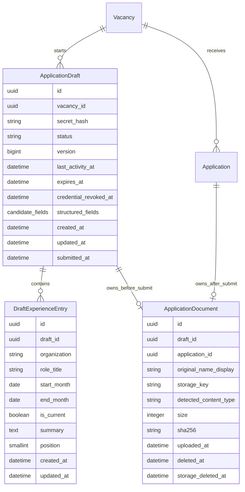

# Domain Model

Phase 2 implements vacancy, application draft, submitted application, and document-metadata models
with UUID identifiers. Phase 3 plans the smallest schema additions needed for lifecycle activity,
optimistic mutation conflicts, bounded employment entries, and retryable physical document
deletion. No migration is created by this plan.

## Planned Phase 3 Diagram

## Existing Models Preserved

### Vacancy

The Phase 2 vacancy schema remains unchanged. Draft creation accepts only a published vacancy whose
`closing_at` has not passed. The vacancy UUID is logged only where a privacy-safe operational event
needs it.

### Application

The submitted application schema remains unchanged in Phase 3. Submission, duplicate handling,
experience-entry transfer, status credentials, and immutability are Phase 4 work.

### Existing ApplicationDraft Fields

Keep the current UUID, vacancy relation, credential hash, status, expiry, submitted timestamp,
lifecycle timestamps, and explicit structured candidate fields. Do not replace them with an
unrestricted JSON form blob.

Existing status values remain:

- `active`;
- `submitted` for the future Phase 4 handoff;
- `abandoned` while revoked data awaits physical cleanup;
- `expired` while revoked data awaits physical cleanup.

The existing `draft_submitted_at_matches_status` constraint remains. Services also enforce allowed
transitions because check constraints alone cannot express the complete lifecycle.

## Proposed Database Changes

### ApplicationDraft Additions

| Field | Type and nullability | Purpose | Index or constraint | Lifecycle and privacy effect |
| --- | --- | --- | --- | --- |
| `version` | `PositiveBigIntegerField(default=1)`, non-null | Detect stale autosave, CRUD, and document mutations. | No standalone index. Checked while the row is locked. | Increment once for every successful mutation; contains no personal data. |
| `last_activity_at` | `DateTimeField(default=timezone.now)`, non-null | Record the last successful meaningful mutation. | No standalone index; cleanup uses `status, expires_at`. | Advances with candidate, experience, and document mutations, not reads. Avoids tracking passive page views. |
| `credential_revoked_at` | `DateTimeField(null=True, blank=True)` | Make credential revocation explicit and independently testable. | No standalone index. Service invariant: active authorization requires null. | Set on abandonment, expiry, and future submission. Never returned to candidates. |

Retain the existing `(status, expires_at)` cleanup index. Do not index personal fields or
`last_activity_at` without a measured query need.

`expires_at` stores the effective candidate-access boundary. The service updates it to the earliest
of `last_activity_at + 7 days`, `created_at + 30 days`, and the related vacancy deadline. Reads do
not renew it. Database checks cannot safely compare against the current clock, so expiry is
enforced by authorization and cleanup services rather than a `NOW()` check constraint.

### New DraftExperienceEntry

Phase 3 explicitly requires create, update, and delete operations for employment entries. Add one
focused child model in `applications`; do not add employer, skill taxonomy, or resume-builder
models.

| Field | Type and nullability | Purpose | Index or constraint | Lifecycle and privacy effect |
| --- | --- | --- | --- | --- |
| `id` | UUID primary key, non-null | Non-sequential API identity. | Primary key. | Not proof of ownership and always checked through the parent draft. |
| `draft` | Foreign key to `ApplicationDraft`, non-null, cascade | Own the entry during Phase 3. | Composite ordering index with `position`. | Cascades when the draft is scrubbed/deleted. Phase 4 decides the submitted-copy model. |
| `organization` | `CharField(max_length=160)`, non-null/non-blank | Short employer or organization label. | No index. | Candidate text; never logged. |
| `role_title` | `CharField(max_length=160)`, non-null/non-blank | Short role label. | No index. | Candidate text; never logged. |
| `start_month` | `DateField`, non-null | Month-level start value stored as first day of month. | Check with end month in application validation; database ordering check where portable. | Avoids unnecessary exact-day collection. |
| `end_month` | `DateField(null=True, blank=True)` | Month-level end value. | Current/end consistency constraint. | Null only for a current role. |
| `is_current` | `BooleanField(default=False)`, non-null | Explain a null end month. | Check: current requires null end; non-current requires an end month. | No sensitive logging. |
| `summary` | `TextField(max_length=600, blank=True)` | Optional concise context not obvious in the CV. | No index. | Personal/application text; scrub and never log. |
| `position` | `PositiveSmallIntegerField`, non-null | Stable candidate-controlled display order. | Unique `(draft, position)` and index `(draft, position)`. | Contains no personal data. Service restricts values to `0..4`. |
| `created_at`, `updated_at` | DateTime, non-null | Record lifecycle. | No standalone indexes. | Follow draft retention. |

Service rules cap entries at five, validate `start_month <= end_month`, reject future-inconsistent
ranges, and normalize API `YYYY-MM` values to the first day of each month. The count cap is a
transactional service rule because a portable check constraint cannot count child rows. Create,
update, reorder, and delete each increment the parent draft version.

The current product brief does not ask candidates to repeat a full CV. Entries therefore remain
optional, concise, explicitly ordered by `position`, and capped at five. The CV, experience level,
skills, and optional free-text summary remain the primary evidence.

### ApplicationDocument Additions

Keep the existing exact-one-owner and one-active-document-per-owner constraints.

| Field | Type and nullability | Purpose | Index or constraint | Lifecycle and privacy effect |
| --- | --- | --- | --- | --- |
| `sha256` | `CharField(max_length=64, null=True, blank=True)` in the first migration | Integrity evidence calculated while streaming. | No uniqueness or index; duplicate CVs are not a product rule. | Service-layer creation requires SHA-256 for every newly accepted Phase 3 upload. Existing fictional metadata keeps null until a later verified migration tightens nullability. |
| `storage_deleted_at` | `DateTimeField(null=True, blank=True)` | Distinguish logical unavailability from confirmed physical deletion. | Partial cleanup index on `(deleted_at, storage_deleted_at)` where supported, or a portable composite index. | Enables retry without restoring access. Metadata is removed after the owning revoked draft and blob are safely cleaned. |

`original_name_display`, `storage_key`, `detected_content_type`, `size`, `uploaded_at`, and
`deleted_at` already exist and remain suitable:

- `original_name_display` is normalized metadata only, never a path or log field;
- `storage_key` is an opaque provider-independent key, unique and never exposed;
- `detected_content_type` records the server result, not the browser claim;
- `size` records validated bytes;
- `deleted_at` immediately removes the record from active authorization;
- `storage_deleted_at` records completion of physical removal.

## Lifecycle And Scrubbing Invariants

- Only `active` drafts with null `credential_revoked_at`, an unexpired `expires_at`, matching cookie
  UUID, and a verified secret may be read or changed.
- A route vacancy never overrides the draft's stored vacancy. Cross-vacancy reuse is rejected.
- Abandonment or expiry sets status and revocation, blanks all candidate text and structured lists,
  resets consent fields, deletes experience children, and logically deletes the document before
  returning or continuing cleanup.
- The document metadata shell may retain only the private storage key and deletion state until the
  blob is physically removed. Original display names are blanked during scrubbing.
- After physical deletion, cleanup hard-deletes the revoked draft shell and document metadata.
- Submitted-state immutability and experience transfer are not implemented until Phase 4.

## Migration Plan

Implementation should create reviewable migrations in this order after approval:

1. Add draft lifecycle/version fields with safe defaults and a data migration that sets
   `last_activity_at` from `updated_at` for existing fictional records.
2. Add `DraftExperienceEntry` and its ordering/current-role constraints.
3. Add document checksum and physical-deletion tracking with `sha256` nullable in the first
   migration. Service-layer creation must require checksums for new uploads, and old fictional
   metadata must remain null rather than receiving a fabricated checksum.
4. Verify migration reversibility and generated SQL. Run SQLite checks locally and inspect
   PostgreSQL SQL/constraints before any real database action.

This plan does not create or apply migrations. Production data migration remains approval-gated.

## Deferred Schema Decisions

- Submitted experience-entry representation and transfer semantics.
- Submitted application retention/export/deletion fields.
- Scanner or quarantine fields; no malware scanner exists.
- OCR, extracted text, parsed CV data, rankings, or AI-derived fields.
- Provider-specific object-store identifiers, buckets, URLs, signed-URL metadata, or candidate
  document IDs.
- Durable audit-event tables unless Phase 3 implementation proves structured logs insufficient.
