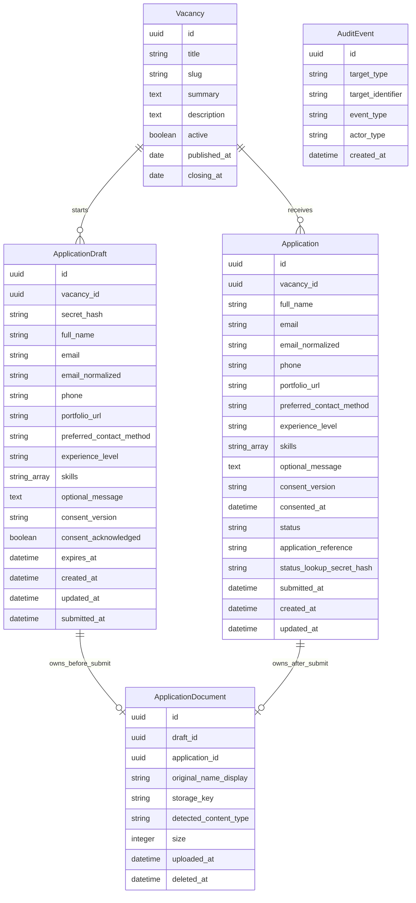

# Domain Model

This is a Phase 0 model proposal. No database schema or migration exists yet.

## Diagram

## Vacancy

Planned fields:

- `id`
- `title`
- `slug`
- `summary`
- `description`
- `responsibilities`
- `requirements`
- `benefits`
- `location`
- `work_format`
- `employment_type`
- `active`
- `published_at`
- `closing_at`
- `created_at`
- `updated_at`

Constraints and indexes:

- Unique slug.
- Index active and closing date for public lists.
- Closing date may be null.
- Public list responses include only active vacancies; a closed detail page may remain available with application disabled.

One vacancy record represents one publication in version one. A materially changed or reopened role is represented by a new vacancy record rather than a publication-cycle entity.

## ApplicationDraft

Use a separate draft model because drafts expire and can be abandoned, while submitted applications have different immutability and retention rules.

Primary candidate data uses explicit structured fields:

- `vacancy`
- `secret_hash`
- `full_name`
- `email`
- `email_normalized`
- `phone`
- `portfolio_url`
- `preferred_contact_method`
- `experience_level`
- `skills`
- `optional_message`
- `consent_version`
- `consent_acknowledged`
- `expires_at`
- `created_at`
- `updated_at`
- `submitted_at`

Do not place these fields in an unrestricted JSON blob. A small schema-bounded JSON field may be considered later for genuinely optional metadata, but it is not a version-one requirement.

Only a secure hash of the draft credential is stored. The credential authorizes one active anonymous draft per browser and is invalidated at submission or abandonment.

## Application

The submitted application stores the copied structured candidate fields. The draft acknowledgement becomes an immutable `consented_at` timestamp paired with `consent_version`. It also stores:

- `status`
- `application_reference`
- `status_lookup_secret_hash`
- `consented_at`
- `submitted_at`
- lifecycle timestamps

Constraints and indexes:

- PostgreSQL unique constraint on `vacancy` plus `email_normalized`.
- Unique `application_reference`.
- Index vacancy and status for authorized admin review.
- Status is limited to `submitted`, `under_review`, or `closed`.
- Submitted candidate fields are immutable; authorized status changes are audited.

The product rule is one submitted application per normalized email and vacancy record. The constraint is authoritative and submission occurs in an atomic transaction. A frontend pre-check is not sufficient protection.

## Skills

Do not create a reusable skill taxonomy in version one. Store a bounded structured list of normalized labels with the field limits defined in [field inventory](field-inventory.md). A separate skill entity is justified only by later filtering or taxonomy requirements.

## ApplicationDocument

Version one permits one private PDF CV per draft or submitted application.

Planned rules:

- Exactly one owner: draft or application.
- At most one active document per owner.
- Generated private storage key; no user-controlled path fragments.
- Original filename retained only as sanitized display metadata when staff need it.
- Maximum 5 MB and PDF-only validation before persistence.
- Object-level authorization before download.
- Draft ownership transfers to the application inside the submission transaction.
- Abandoned and expired draft documents are deleted with the draft.
- Submitted documents follow the reviewed retention policy.

Do not add a scan-status field unless a scanner is actually integrated. Version one does not claim malware scanning.

## AuditEvent

Keep durable audit events narrow:

- Application-status changes.
- Authorized document access when operationally required.
- Expired-draft and document cleanup.
- Security-relevant administrative changes.

Audit records contain event category, actor type, target identifier, timestamp, and schema-bounded non-personal metadata only. They must not contain candidate contact data, document contents or paths, draft credentials, or status lookup credentials. ApplyFlow does not require event sourcing or analytics infrastructure.
