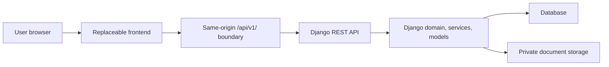

# Frontend Integration Contract

This package protects the boundary between ApplyFlow's replaceable candidate frontend and the
stable Django API, draft-security model, database schema, and private document storage.

Read this before changing frontend architecture, replacing the Nuxt app, building a parallel
frontend, or creating a white-label variant.

## Contract Status

- Status: Active
- API version: `/api/v1/`
- Verified against: current `phase-3-secure-drafts-upload` implementation
- Verification basis: backend tests, frontend tests, mocked Playwright, and real Django full-stack
  Playwright
- Maintainer: JALOLBEK JR

## What Is Replaceable

- Page layout, visual design, typography, motion, and responsive composition.
- Vue components, layouts, route presentation, and source-controlled brand configuration.
- The frontend framework, if the replacement preserves the documented API and security behavior.
- The local implementation of typed API clients and composables.

## What Is Not Frontend-Replaceable

- `/api/v1/` endpoint paths, trailing slashes, request and response semantics.
- HttpOnly draft-ownership cookie behavior.
- CSRF bootstrap and unsafe-request protection.
- `ETag` and `If-Match` draft-version conflict handling.
- Private CV storage, PDF validation, and metadata-only document responses.
- Django models, migrations, serializers, views, permissions, storage services, and database
  constraints.

These contracts are not permanently immutable. They may change only through an explicitly
coordinated and versioned backend task with compatibility analysis, updated tests, migration review
where applicable, and corresponding frontend contract and documentation updates.

## Current Technology

| Layer           | Current implementation                                                       |
| --------------- | ---------------------------------------------------------------------------- |
| Frontend        | Nuxt 4.4.8, Vue 3.5.38, TypeScript, project CSS, Vitest, Playwright          |
| Backend         | Django 5.2.15, Django REST Framework 3.17.1                                  |
| Local storage   | SQLite for local/test database, private local document root                  |
| Target database | PostgreSQL-ready settings; PostgreSQL runtime validation remains future work |

## Architecture

The frontend never communicates directly with the database. A frontend-only change must not require
Django model or migration changes. Visual design and component structure are replaceable; API
semantics, security rules, and data lifecycle are stable integration boundaries.

## Documents

- [Architecture boundary](architecture-boundary.md)
- [Frontend-facing API contract](api-contract.md)
- [Security contract](security-contract.md)
- [Draft lifecycle](draft-lifecycle.md)
- [CV upload contract](cv-upload-contract.md)
- [Error handling](error-handling.md)
- [Replacement runbook](replacement-runbook.md)
- [Testing contract](testing-contract.md)
- [Change checklist](change-checklist.md)

## Current Limitations

Final application submission and private status lookup are not implemented. The frontend must not
call guessed endpoints or present fictional submission credentials as real. Production deployment,
scheduled cleanup, PostgreSQL concurrency validation, monitoring, backups, and CI remain separate
future work.
