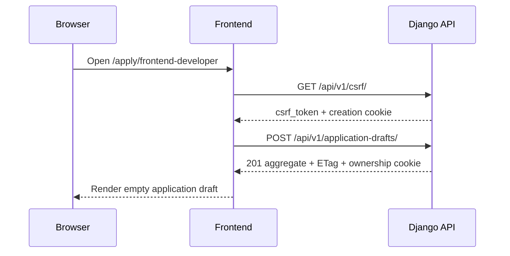
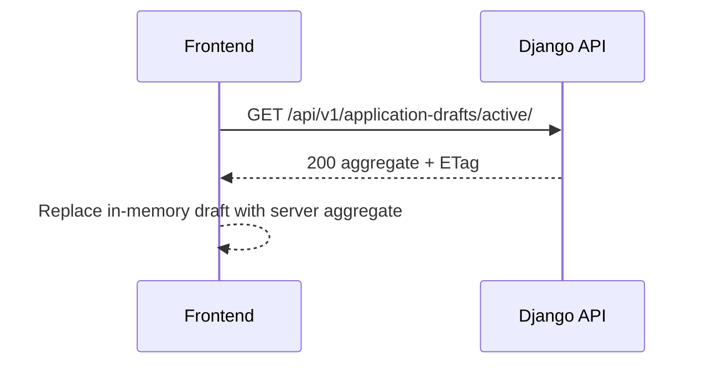
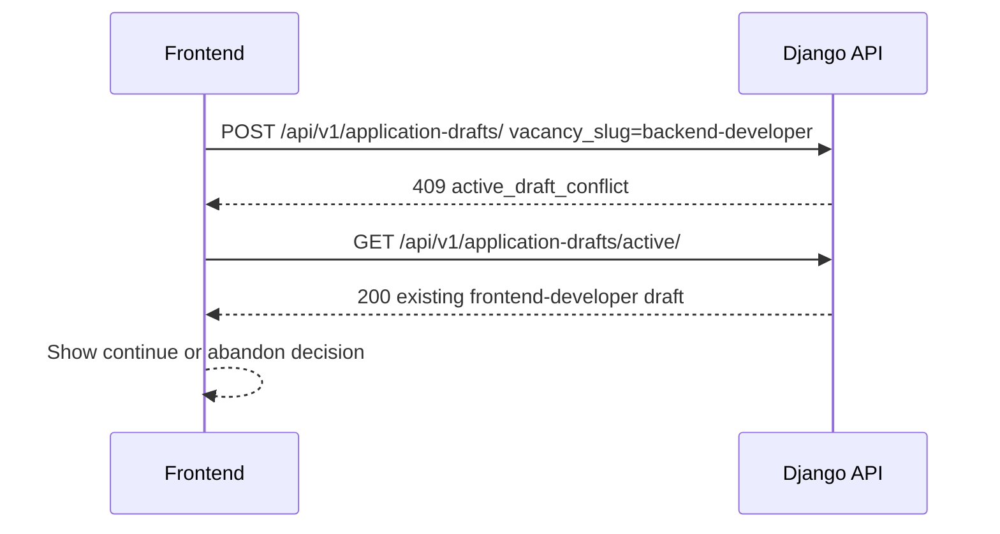
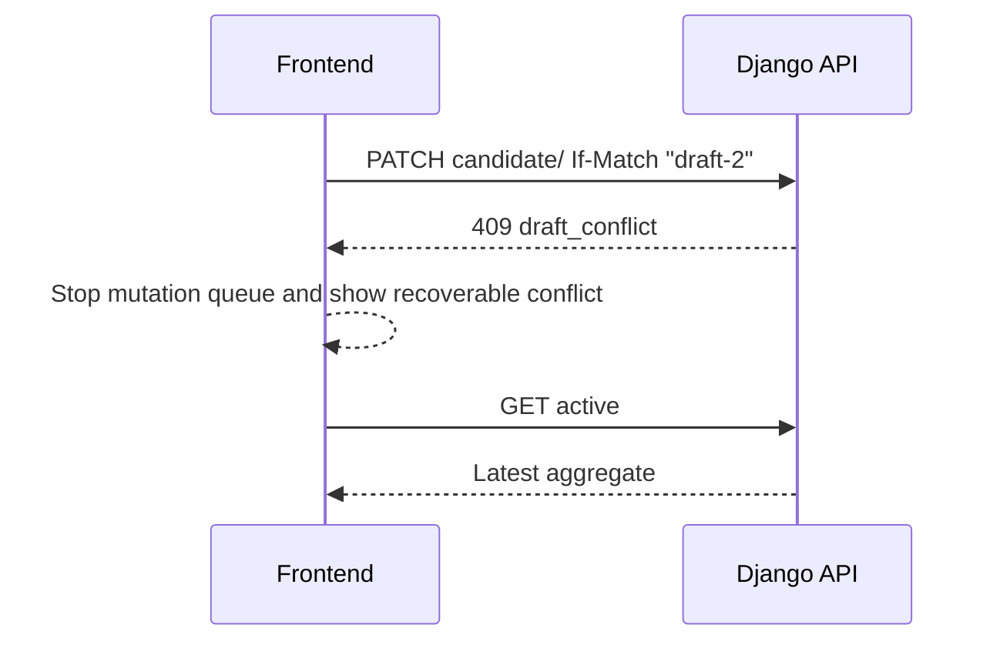
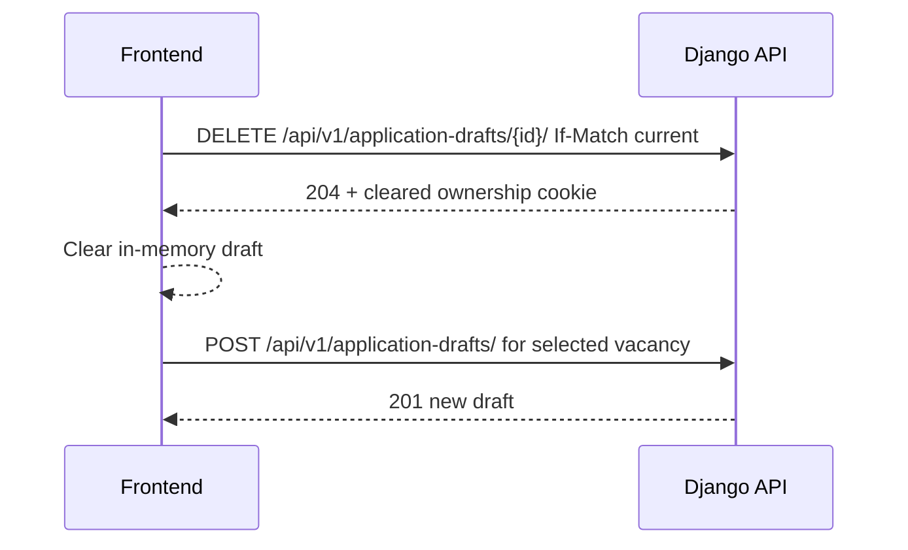

# Draft Lifecycle

ApplyFlow supports one active anonymous application draft per browser. Drafts are authorized by a
same-origin HttpOnly cookie and refreshed through the backend aggregate.

## State Guide

| State                     | Frontend action                               | API request                                            | Server result                                             | UI state                                               | Renew retention    | Version changes              |
| ------------------------- | --------------------------------------------- | ------------------------------------------------------ | --------------------------------------------------------- | ------------------------------------------------------ | ------------------ | ---------------------------- |
| No active draft           | Open vacancy/application route                | `GET /api/v1/application-drafts/active/` or start POST | `204` for active lookup, `201` on create                  | Empty local draft until create succeeds                | Create sets expiry | Create starts at version 1   |
| CSRF/bootstrap            | First unsafe request or startup               | `GET /api/v1/csrf/`                                    | Masked token JSON; CSRF and creation cookies              | Token held in memory only                              | No                 | No                           |
| Start application         | Candidate starts a vacancy                    | `POST /api/v1/application-drafts/`                     | Draft aggregate and ownership cookie                      | Position/details flow opens                            | Yes on create      | Create version               |
| Same-vacancy restoration  | Refresh or revisit                            | `GET active` or `POST application-drafts`              | `200` aggregate                                           | In-memory state restored                               | Reads do not renew | No for reads                 |
| Another-vacancy conflict  | Navigate to another vacancy with active draft | `POST application-drafts`                              | `409 active_draft_conflict`; then `GET active`            | Continue or abandon decision                           | No                 | No                           |
| Candidate update          | Continue details                              | `PATCH candidate/`                                     | `200` aggregate                                           | Saved state                                            | Yes                | Yes                          |
| Experience update         | Continue review                               | `PATCH experience/`                                    | `200` aggregate                                           | Saved state                                            | Yes                | Yes                          |
| Experience-entry mutation | Add/edit/remove role                          | `POST/PATCH/DELETE experiences`                        | Aggregate or `204` with ETag                              | Saved role list updates                                | Yes                | Yes                          |
| CV upload                 | Select valid PDF                              | `PUT documents/cv/`                                    | `201` or `200` aggregate                                  | Metadata shown                                         | Yes                | Yes                          |
| Browser refresh           | Reload an application route                   | `GET active` or create same vacancy                    | `200` aggregate                                           | Candidate sees saved values                            | No for read        | No                           |
| Draft expiration          | Cookie or draft no longer valid               | Any draft request                                      | `404 draft_unavailable` and cookie clear where applicable | Generic unavailable recovery                           | No                 | Terminal                     |
| Draft unavailable         | Wrong/missing/revoked/cross-draft credential  | Any protected draft route                              | Generic `404 draft_unavailable`                           | Local draft must be cleared or recovered intentionally | No                 | No                           |
| Draft abandonment         | Candidate confirms delete                     | `DELETE application-drafts/{id}/`                      | `204`, cookie cleared                                     | Empty draft for new vacancy                            | Terminal           | Yes before terminal response |
| Future submission         | Not implemented                               | None                                                   | No endpoint                                               | Submit remains unavailable                             | Deferred           | Deferred                     |

## New Application

## Restore After Refresh

## Active Draft For Another Vacancy

## Update With Version Conflict

## Abandon Draft

## Security Implications

Reads do not renew retention. Successful mutations renew inactivity expiry only within the
thirty-day absolute lifetime and vacancy deadline. The frontend must treat unavailable, expired,
wrong-draft, and revoked draft errors generically to avoid object-existence disclosure.
