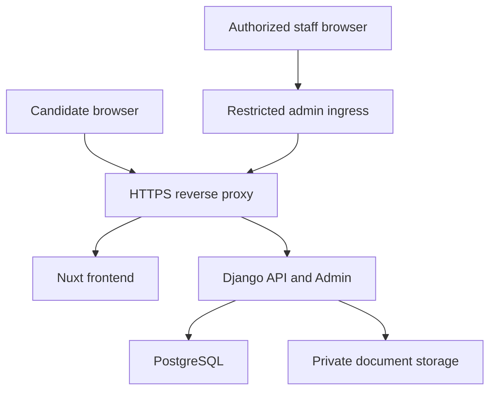

# Infrastructure Plan

The Nuxt frontend and Django backend foundation run locally. Django supports PostgreSQL through
`DATABASE_URL`; SQLite is the default local bootstrap. Production infrastructure, private document
storage, Docker, and deployment configuration are not implemented.

## Local Development Services

Current local services:

- Frontend: Nuxt development server.
- Backend: Django development server.
- Database: SQLite by default, or an explicitly configured PostgreSQL service.

Planned capability:

- Private document storage: local private directory served only through authorized Django views.

Redis and Celery are not planned for version one. Cleanup can start as a Django management command until a real queue requirement appears.

## Production Topology

## Deployment Approach

Prefer same-origin deployment. See [ADR 0009](decisions/0009-same-origin-deployment.md).

Planned concerns:

- HTTPS termination.
- Secure cookies.
- CSRF protection.
- Static assets.
- Private media/document access.
- Restricted and hardened Django Admin ingress; an obscure path is not an access control.
- Least-privilege staff permissions and explicit document authorization.
- Environment validation.
- Database migrations.
- Health checks.
- Backup and restore.
- Log retention.

## Docker Planning

Docker and deployment configuration are deferred until Phase 6.

Planned requirements:

- Multi-stage builds.
- Pinned base image versions.
- Non-root runtime where practical.
- `.dockerignore`.
- Separate development and production configuration.
- Health checks.
- Explicit environment variables.
- No secrets baked into images.

## Environment Variables

`.env.example` is present for local development shape only. Real secrets must not be committed.

Likely future variables:

- `APP_ENV`
- `DEBUG`
- `DATABASE_URL`
- `DJANGO_SECRET_KEY`
- `ALLOWED_HOSTS`
- `CSRF_TRUSTED_ORIGINS`
- `CORS_ALLOWED_ORIGINS` only if split-origin dev needs it
- `DOCUMENT_STORAGE_BACKEND`
- `DOCUMENT_MAX_UPLOAD_MB`
- `SECURE_COOKIE_SETTINGS`

## Backup And Restore

Before real recruitment use, define:

- PostgreSQL backup schedule.
- Document storage backup schedule.
- Restore drill.
- Retention policy.
- Deletion handling.

For fictional test data, keep backups small and do not include real personal data.

## Runbook Link

Operational procedures are outlined in [runbook outline](runbook-outline.md).
