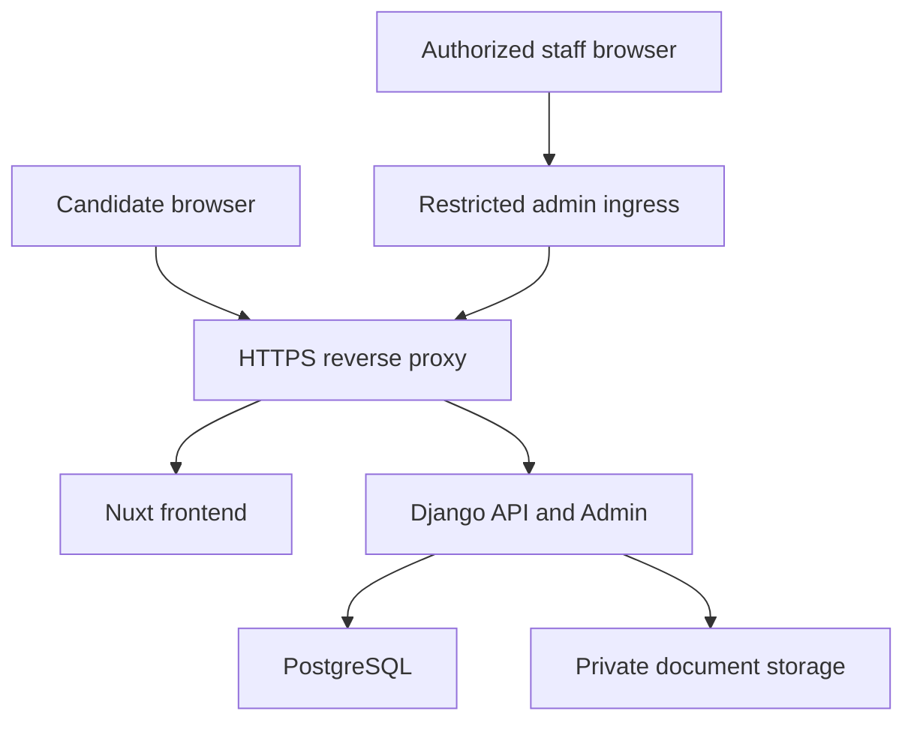

# Infrastructure Plan

The Nuxt frontend and Django backend foundation run locally. Django supports PostgreSQL through
`DATABASE_URL`; SQLite is the default local bootstrap. Phase 3 includes a provider-neutral private
document-storage boundary with a local development adapter. Production object storage, Docker, and
deployment configuration are not implemented.

## Local Development Services

Current local services:

- Frontend: Nuxt development server.
- Backend: Django development server.
- Database: SQLite by default, or an explicitly configured PostgreSQL service.

Phase 3 local capability:

- The browser calls `/api/**` on the Nuxt origin. A Nuxt development proxy forwards those requests
  to Django, so ownership cookies and CSRF remain same-origin even when the processes use separate
  ports.
- Use one local hostname consistently. Mixing `localhost` and `127.0.0.1` creates different cookie
  hosts and confusing CSRF failures.
- Private document storage uses an ignored directory outside static and public media routing. No
  Django, Nuxt, or web-server route serves that directory during Phase 3.
- A provider-neutral application storage interface owns save, open, delete, existence, and stale-key
  enumeration. The implemented Phase 3 adapter is `local_private`, rooted at an ignored
  development directory by default; a deterministic fake adapter supports tests. Domain models
  persist only opaque storage keys and no API returns storage paths or URLs.
- Local SQLite remains the default. PostgreSQL-specific concurrency validation requires a separately
  approved local/test service before production claims. A free local PostgreSQL or Docker runtime,
  or a later GitHub Actions service container, is sufficient for that verification track.

Redis and Celery are not planned for version one. Draft expiry, pending physical deletion, and stale
orphan cleanup begin as one idempotent, batch-bounded Django management command with dry-run output.
Scheduling remains a deployment decision.

## Production Topology

## Deployment Approach

Prefer same-origin deployment. See [ADR 0009](decisions/0009-same-origin-deployment.md).

Planned concerns:

- HTTPS termination.
- Secure cookies.
- CSRF protection.
- Static assets.
- Private media/document access.
- Restricted and hardened Django Admin ingress; an obscure path is not an access control.
- Least-privilege staff permissions and explicit document authorization.
- Environment validation.
- Database migrations.
- Health checks.
- Backup and restore.
- Log retention.

Phase 3 does not implement this topology. Browser APIs remain same-origin only, so no CORS package
or cross-origin credential policy is planned. Production private object storage and authenticated
staff download remain deferred.

## Docker Planning

Docker and deployment configuration are deferred until Phase 6.

Planned requirements:

- Multi-stage builds.
- Pinned base image versions.
- Non-root runtime where practical.
- `.dockerignore`.
- Separate development and production configuration.
- Health checks.
- Explicit environment variables.
- No secrets baked into images.

## Environment Variables

`.env.example` is present for local development shape only. Real secrets must not be committed.

Implemented foundation variables:

- `APP_ENV`
- `DJANGO_DEBUG`
- `DATABASE_URL`
- `DJANGO_SECRET_KEY`
- `DJANGO_ALLOWED_HOSTS`
- `DRAFT_COOKIE_NAME=applyflow_draft`
- `DRAFT_COOKIE_PATH=/api/v1/application-drafts/`: fixed for Phase 3. `/`, `/api/`, arbitrary
  alternatives, and malformed values are rejected during settings load with
  `ImproperlyConfigured`.
- `DRAFT_COOKIE_SECURE`: defaults to insecure only for explicit `APP_ENV=development` local HTTP;
  staging and production-like environments force secure ownership and creation cookies even when
  this variable is false.
- `DRAFT_INACTIVITY_SECONDS=604800`: accepts only integers from `60` through `604800`.
- `DRAFT_ABSOLUTE_SECONDS=2592000`: accepts only integers from `60` through `2592000`, and must be
  greater than or equal to `DRAFT_INACTIVITY_SECONDS`.
- `DRAFT_CREATION_COOKIE_NAME=applyflow_draft_creation`
- `DRAFT_CREATION_KEY_LIFETIME_SECONDS=600`: bounds the server-issued creation key used for
  database-backed retry safety and accepts only integers from `30` through `900`. Raw creation keys
  are generated by the server and are never configured or persisted.
- `DOCUMENT_STORAGE_BACKEND=local_private`: the only approved Phase 3 backend. Unknown, empty,
  whitespace-altered, or dynamically imported backend names fail settings loading.
- `DOCUMENT_MAX_UPLOAD_BYTES=5242880`: the fixed application CV limit. Missing values use the
  approved default, and configured values must be the exact ASCII decimal string `5242880` with no
  whitespace, signs, separators, Unicode digits, scientific notation, or clamping.
- `DOCUMENT_PRIVATE_ROOT`: optional only in `APP_ENV=development`, where the safe ignored default is
  `backend/.private-documents/`. Non-development environments must set an explicit absolute private
  path that is not the repository root and is not inside static, staticfiles, media, or frontend
  public roots. Settings validation does not create the directory; the adapter creates an approved
  local root lazily when storage is used.

All three duration variables accept only non-empty ASCII decimal digit strings matching `^[0-9]+$`.
Leading or trailing whitespace, embedded whitespace, positive or negative signs, underscores,
commas or other numeric separators, decimal notation, scientific notation, hexadecimal, binary or
octal notation, Unicode numeral characters, empty values, and excessively long inputs are rejected
during Django settings loading with `ImproperlyConfigured`. Values are not stripped, normalized,
repaired, or silently clamped.

All three duration settings reject zero, negatives, malformed values, and out-of-range values
without silent clamping. Missing values use the defaults above. Invalid values stop settings loading
with `ImproperlyConfigured`. Production-like environments still require secure cookies.

Frontend local-development variable:

- `NUXT_API_PROXY_TARGET`: server-only Nuxt development proxy target. Missing values default to
  `http://127.0.0.1:8000`. Configured values must be HTTP loopback origins using `localhost`,
  `127.0.0.1`, or `[::1]`; credentials, query strings, fragments, paths, non-loopback hosts,
  non-HTTP schemes, malformed ports, and whitespace-repaired values are rejected.

Planned later-phase variables:

- `CSRF_TRUSTED_ORIGINS`

Do not add `CORS_ALLOWED_ORIGINS` for the accepted Phase 3 topology. If a future deployment changes
the origin model, it requires a reviewed architecture decision rather than an ad hoc setting.

## Upload And Cleanup Limits

- Exact accepted file limit: 5 MiB (`5,242,880` bytes).
- Future proxy request-body ceiling: 6 MiB to allow multipart overhead while the application keeps
  the authoritative 5 MiB file limit.
- Future serving/proxy request timeout: 30 seconds for upload endpoints.
- File upload memory threshold: conservative enough to spool CVs to temporary files rather than
  retain the maximum body in worker memory.
- Effective draft expiry: the earliest of inactivity TTL, absolute TTL, and the vacancy deadline.
- Orphan grace period: 24 hours before a provider key with no live metadata is eligible for removal.
- Cleanup operates in bounded batches and outputs aggregate counts without candidate data,
  filenames, hashes, or storage keys. Structured cleanup logging and monitoring remain deferred.

## Backup And Restore

Before real recruitment use, define:

- PostgreSQL backup schedule.
- Document storage backup schedule.
- Restore drill.
- Retention policy.
- Deletion handling.

For fictional test data, keep backups small and do not include real personal data.

## Runbook Link

Operational procedures are outlined in [runbook outline](runbook-outline.md).
