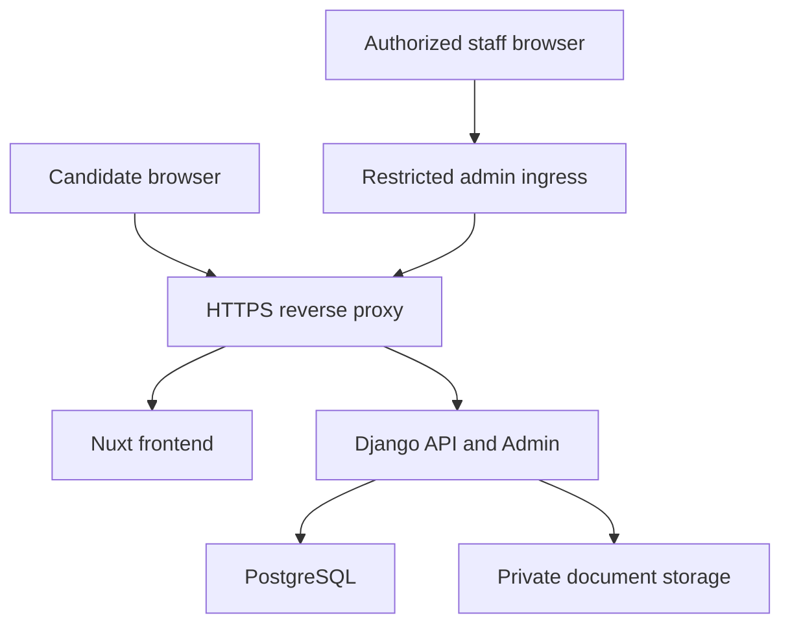

# Infrastructure Plan

The Nuxt frontend and Django backend foundation run locally. Django supports PostgreSQL through
`DATABASE_URL`; SQLite is the default local bootstrap. Production infrastructure, private document
storage, Docker, and deployment configuration are not implemented.

## Local Development Services

Current local services:

- Frontend: Nuxt development server.
- Backend: Django development server.
- Database: SQLite by default, or an explicitly configured PostgreSQL service.

Phase 3 planned local capability:

- The browser calls `/api/**` on the Nuxt origin. A Nuxt development proxy forwards those requests
  to Django, so ownership cookies and CSRF remain same-origin even when the processes use separate
  ports.
- Use one local hostname consistently. Mixing `localhost` and `127.0.0.1` creates different cookie
  hosts and confusing CSRF failures.
- Private document storage uses an ignored directory outside static and public media routing. No
  Django, Nuxt, or web-server route serves that directory during Phase 3.
- A provider-neutral application storage interface owns save, open, delete, existence, and stale-key
  enumeration. Domain models persist only opaque storage keys.
- Local SQLite remains the default. PostgreSQL-specific concurrency validation requires a separately
  approved local/test service before production claims. A free local PostgreSQL or Docker runtime,
  or a later GitHub Actions service container, is sufficient for that verification track.

Redis and Celery are not planned for version one. Draft expiry, pending physical deletion, and stale
orphan cleanup begin as one idempotent, batch-bounded Django management command with dry-run output.
Scheduling remains a deployment decision.

## Production Topology

## Deployment Approach

Prefer same-origin deployment. See [ADR 0009](decisions/0009-same-origin-deployment.md).

Planned concerns:

- HTTPS termination.
- Secure cookies.
- CSRF protection.
- Static assets.
- Private media/document access.
- Restricted and hardened Django Admin ingress; an obscure path is not an access control.
- Least-privilege staff permissions and explicit document authorization.
- Environment validation.
- Database migrations.
- Health checks.
- Backup and restore.
- Log retention.

Phase 3 does not implement this topology. Browser APIs remain same-origin only, so no CORS package
or cross-origin credential policy is planned. Production private object storage and authenticated
staff download remain deferred.

## Docker Planning

Docker and deployment configuration are deferred until Phase 6.

Planned requirements:

- Multi-stage builds.
- Pinned base image versions.
- Non-root runtime where practical.
- `.dockerignore`.
- Separate development and production configuration.
- Health checks.
- Explicit environment variables.
- No secrets baked into images.

## Environment Variables

`.env.example` is present for local development shape only. Real secrets must not be committed.

Likely future variables:

- `APP_ENV`
- `DEBUG`
- `DATABASE_URL`
- `DJANGO_SECRET_KEY`
- `ALLOWED_HOSTS`
- `CSRF_TRUSTED_ORIGINS`
- `DOCUMENT_STORAGE_BACKEND` with `local_private` as the Phase 3 development value
- `DOCUMENT_PRIVATE_ROOT`
- `DOCUMENT_MAX_UPLOAD_BYTES=5242880`
- `DRAFT_COOKIE_SECURE` derived from environment rather than freely weakened in production
- `DRAFT_TTL_SECONDS=604800`
- `DRAFT_ABSOLUTE_TTL_SECONDS=2592000`
- `NUXT_API_PROXY_TARGET` for local development only

Do not add `CORS_ALLOWED_ORIGINS` for the accepted Phase 3 topology. If a future deployment changes
the origin model, it requires a reviewed architecture decision rather than an ad hoc setting.

## Upload And Cleanup Limits

- Exact accepted file limit: 5 MiB (`5,242,880` bytes).
- Future proxy request-body ceiling: 6 MiB to allow multipart overhead while the application keeps
  the authoritative 5 MiB file limit.
- Future serving/proxy request timeout: 30 seconds for upload endpoints.
- File upload memory threshold: conservative enough to spool CVs to temporary files rather than
  retain the maximum body in worker memory.
- Effective draft expiry: the earliest of inactivity TTL, absolute TTL, and the vacancy deadline.
- Orphan grace period: 24 hours before a provider key with no live metadata is eligible for removal.
- Cleanup operates in bounded batches and logs aggregate counts without candidate data, filenames,
  hashes, or storage keys.

## Backup And Restore

Before real recruitment use, define:

- PostgreSQL backup schedule.
- Document storage backup schedule.
- Restore drill.
- Retention policy.
- Deletion handling.

For fictional test data, keep backups small and do not include real personal data.

## Runbook Link

Operational procedures are outlined in [runbook outline](runbook-outline.md).
