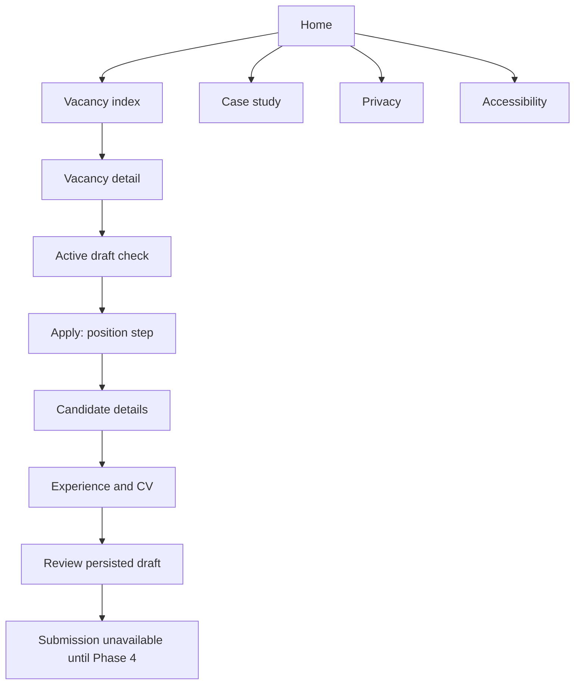
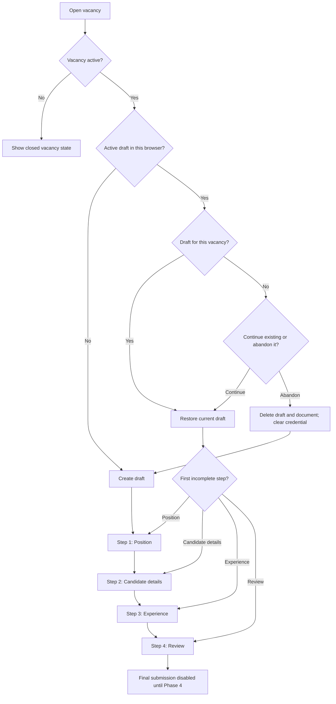

# User Flow

## Public Flow

## Application Step Flow

## Error Paths

- Closed vacancy: the apply action is disabled and the page explains that applications are no longer accepted.
- Expired, missing, or invalid draft credential: return a generic safe response, do not reveal whether another draft exists, and offer a new start when appropriate.
- Invalid field: inline error appears, the error summary links to the field, and focus moves to the summary after failed step submission.
- Invalid upload: browser feedback handles obvious file-selection mistakes, and the backend remains
  authoritative for PDF validation.
- Upload interruption: candidate can cancel, review the refreshed draft metadata, and deliberately
  retry or remove the file.
- Stale draft version: the client refreshes the authorized aggregate, preserves visible form values
  where practical, and asks the candidate to review before saving again.
- Final submission and status lookup: disabled/deferred until Phase 4; no fake application reference
  or status result is returned from the real candidate path.

## Confirmation Flow

The confirmation route is retained only as future-facing copy while Phase 4 is unimplemented. It
does not show a generated application reference or status lookup secret from the real flow.

Phase 4 is expected to show:

- Application received message.
- Submitted vacancy.
- Human-readable application reference.
- Status lookup secret shown once for candidate retention.
- Status lookup link.
- Reminder that the status lookup secret is private and the application reference is not proof of ownership.
- Privacy and retention note.

It must not expose internal notes or promise response timelines that the fictional company cannot
guarantee.
