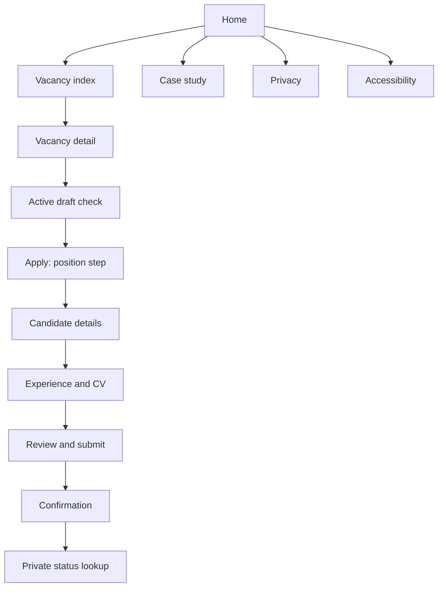
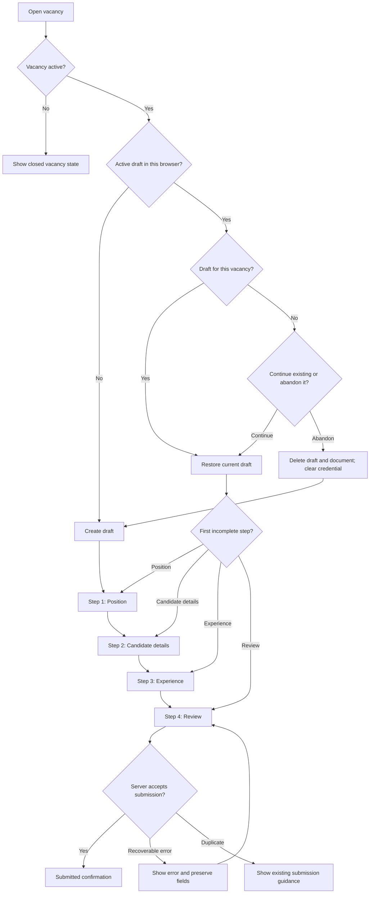

# User Flow

## Public Flow

## Application Step Flow

## Error Paths

- Closed vacancy: the apply action is disabled and the page explains that applications are no longer accepted.
- Expired, missing, or invalid draft credential: return a generic safe response, do not reveal whether another draft exists, and offer a new start when appropriate.
- Invalid field: inline error appears, the error summary links to the field, and focus moves to the summary after failed step submission.
- Invalid upload: the selected file is rejected before submission, with format and size guidance.
- Upload interruption: candidate can cancel, retry, or remove the file.
- Duplicate submission: final submission is blocked when the normalized email already has a submitted application for the same vacancy record.
- Status lookup miss: response is generic and does not reveal whether the application reference or status lookup secret exists.

## Confirmation Flow

The confirmation page shows:

- Application received message.
- Submitted vacancy.
- Human-readable application reference.
- Status lookup secret shown once for candidate retention.
- Status lookup link.
- Reminder that the status lookup secret is private and the application reference is not proof of ownership.
- Privacy and retention note.

It does not expose internal notes or promise response timelines that the fictional company cannot guarantee.
